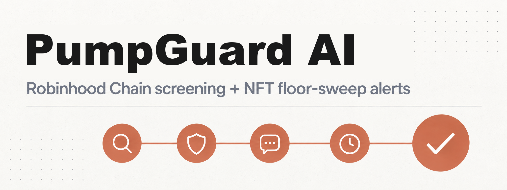
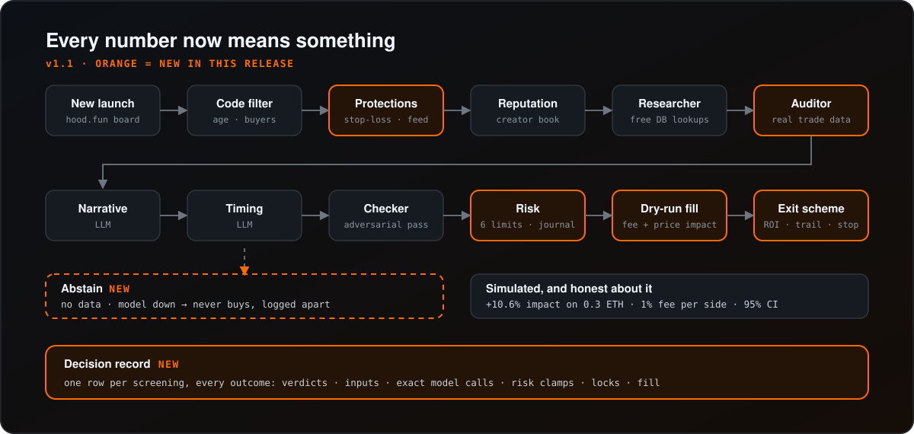

<p align="center">
  
</p>

<p align="center">
  <a href="https://github.com/AtenovD/PumpGuard-AI/actions/workflows/ci.yml"></a>
  <a href="https://railway.com/new/template?template=https%3A%2F%2Fgithub.com%2FAtenovD%2FPumpGuard-AI&amp;envs=BOT_TOKEN%2CADMIN_IDS%2CGROK_API_KEY"></a>
  <a href="https://render.com/deploy?repo=https%3A%2F%2Fgithub.com%2FAtenovD%2FPumpGuard-AI"></a>
</p>

<p align="center">
  <a href="https://github.com/AtenovD/PumpGuard-AI/stargazers"></a>
  <a href="https://github.com/AtenovD/PumpGuard-AI/blob/main/LICENSE"></a>
  <a href="https://github.com/AtenovD/PumpGuard-AI/commits/main"></a>
</p>
<p align="center">
  
  
  
  
  
  
</p>

<p align="center">
  A Telegram bot that screens new Robinhood Chain / hood.fun token launches through four LLM-powered agents, a risk manager, and a creator reputation book - then simulates the trade. No live execution, ever. Bring your own model: Grok by default, or any OpenAI-compatible chat-completions API.
</p>

<h3 align="center">Most screeners show you what passed.<br>This one keeps the receipt for everything else - and prices every simulated trade like it was real.</h3>

<table align="center">
  <tr>
    <td align="center"></td>
    <td align="center"><a href="https://railway.com/new/template?template=https%3A%2F%2Fgithub.com%2FAtenovD%2FPumpGuard-AI&envs=BOT_TOKEN%2CADMIN_IDS%2CGROK_API_KEY"></a></td>
    <td align="center"></td>
    <td align="center"><a href="https://render.com/deploy?repo=https%3A%2F%2Fgithub.com%2FAtenovD%2FPumpGuard-AI"></a></td>
  </tr>
  <tr>
    <td align="center"></td>
    <td align="center"><a href="#deploy-with-docker"></a></td>
    <td align="center"></td>
    <td align="center"><a href="#deploy-on-a-vps-systemd"></a></td>
  </tr>
  <tr>
    <td align="center"></td>
    <td align="center"><a href="#quick-start"></a></td>
    <td align="center"></td>
    <td align="center"><a href="#read-only-dashboard"></a></td>
  </tr>
  <tr>
    <td align="center"></td>
    <td align="center"><a href="docs/webhook-schema.md"></a></td>
    <td align="center"></td>
    <td align="center"><a href="docs/adding-a-chain.md"></a></td>
  </tr>
  <tr>
    <td align="center"></td>
    <td align="center"><a href="#nft-screener-robinhood-chain"></a></td>
  </tr>
</table>

<p align="center">
  
</p>

## ⚠️ What this is and isn't

This is a **research/screening tool**, not a trading bot. Every "buy" and "sell" is simulated (dry-run): no wallet, no signing, no on-chain transaction. Bonding-curve memecoins on pump.fun routinely lose their entire value. Nothing here is financial advice, and there is no live executor to wire up - that's a deliberately different, much higher-stakes piece of software that this project does not include.

<p align="center">
  
</p>

## What's new in v1.1 - honest simulation

<p align="center">
  
</p>

A backtest is only worth reading if the simulation under it is honest. Auditing v1.0 against live hood.fun data turned up several places where it was not, so v1.1 fixes the *numbers* rather than adding more agents.

| | Before | Now |
|---|---|---|
| **Fills** | Filled at spot, no fee, no price impact | Priced off the bonding curve: 1% fee each side plus real impact (0.3 ETH into a fresh curve moves the price ~10.6%, on top of the fee) |
| **Exits** | Stop-loss was the *only* way out, so every closed trade was a loser and win rate was zero by construction | ROI table, trailing stop, time stop and stop-loss, all judged on the **net** value of a sale |
| **Auditor** | Was handed empty trade and holder data | Gets the launchpad's real trade counts, volumes and recent trades; abstains when there is nothing to audit |
| **Model down?** | Logged as a rejection, polluting the funnel | **Abstain** - never buys, counted separately |
| **"New" launches** | Anything not in the first poll counted as new, however old | A token older than `MAX_LAUNCH_AGE_SECONDS` is never a launch; records with no timestamp are ignored |
| **Rejected tokens** | One line in a log | A full **decision record**: verdicts, inputs, exact model calls, risk clamps |
| **Position size** | A model score of `5` could size a trade at 5x the limit | Scores bounded to 0-1; every clamp journaled; new total-exposure limit |
| **After a bad run** | Kept buying | Stop-loss guard pauses entries; an unhealthy price feed locks them |
| **Report** | A win rate with no context | Net PnL after costs, exit breakdown, **95% confidence interval** and a plain verdict like *"too few trades to conclude anything"* |
| **Units** | "SOL" on an ETH chain | ETH everywhere (old env names still work) |

Read more: [simulation model and every assumption](docs/simulation-model.md) · [decision records](docs/decision-records.md) · [changelog](CHANGELOG.md)

## Features

<p align="center">
  
</p>

- **Robinhood Chain launch monitor** - watches hood.fun launches on Robinhood Chain, filters by age and buyer count before spending a single model call
- **Five agents**, cheapest first:
  - **Researcher** - free DB lookups before any model call: has this creator rugged before, and does this name/symbol exactly or semantically copy a recent token
  - **Auditor** (LLM) - looks for wash trading and one-sided buying in the launchpad's real trade statistics (holder data is not available). With fewer than three observed trades it abstains without spending a call
  - **Narrative** (LLM) - scores the meme's attention potential from its name/symbol
  - **Timing** (LLM) - judges the current window using only this bot's own observed launch/outcome rate (no external price feeds)
  - **Checker** (LLM, stronger model) - an adversarial final pass given all four prior verdicts, explicitly looking for a reason to reject
- **Real price tracking** - open dry-run positions are watched against the chain's actual bonding-curve or DEX-pool price, not a random number
- **Exit scheme** - stop-loss, a time-decaying ROI take-profit table, a trailing stop and a time stop. Every rule is judged on what a sale would actually return after fee and price impact
- **Cost-aware simulation** - fills are priced off the bonding curve, so size matters: a buy costs about 1.4% over spot at 0.01 ETH and about 19% at 0.5 ETH, fee included
- **Abstain, not guess** - a model outage, an unparseable reply or missing data is an abstention: it can never buy and is reported apart from rejections
- **Decision records** - every outcome, not just the passes, saves a full record you can query (`GET /api/decisions`)
- **Protections** - a stop-loss guard pauses new entries after a cluster of stop-outs, and an unhealthy price feed locks them until it recovers
- **Circuit breaker on the model API** - after several consecutive failures, the pipeline stops calling the model for a cooldown window instead of hammering a struggling API on every new launch
- **Explainability digest** - the four agent verdicts are synthesized by the model into one short, readable paragraph for the alert, instead of four raw JSON summaries
- **Optional user Grok OAuth** - users can connect their own Grok account with authorization-code PKCE and request a fresh, detailed second opinion for a signal. Encrypted user tokens never replace the bot's core `GROK_API_KEY` pipeline
- **Prompt-injection resistant** - token symbol/name/description are attacker-controlled. They're sanitized and every agent prompt explicitly frames them as data, not instructions, before anything reaches Grok
- **Risk manager** - six independent limits: max ETH per trade, daily loss limit, total open exposure, max trades/day, max open positions, stop-loss. Pure arithmetic, no model involved, the last gate before a (simulated) trade, and every clamp it applies is journaled
- **Reputation book** - creators are blocked after their tracked launches rug, forgotten after a configurable number of days
- **Dry-run executor** - simulates entry and exit against the real bonding-curve reserves, feeding the reputation book and daily counters exactly like a live executor would
- **Performance report** - summarises what the bot recorded going forward (it is not a historical replay): funnel, abstentions, net PnL after costs, exit breakdown, and a bootstrap confidence interval with a sample-size verdict
- **Weekly public digest** - optionally publishes the previous seven days of recorded backtest performance to a separate public channel
- **Button-only Telegram frontend**: RU/EN language picker, stats, open positions, optional mandatory-subscription gate, button-driven admin panel - no slash commands beyond `/start`
- **Read-only web dashboard** - responsive funnel, recorded-performance summary, open positions, and a polling JSON stats endpoint without a second market-data connection
- **Versioned signal webhooks** - optionally POST every passing `TokenAnalysis` to multiple integrations with one retry and a stable v1 JSON envelope
- **Prometheus metrics** - dashboard `/metrics` exposes cumulative screening outcomes, positions, model circuit-breaker state, and per-chain price-feed health
- **NFT screener** (optional) - a second, independent pipeline screens new Robinhood Chain NFT collections for wash-minting and hype, alert-only
- **Floor-sweep alerts** - watches every screened collection's floor price and alerts on a sudden collapse (possible rug) or spike (possible breakout)
- **Cross-surface signal** - flags when the same creator address launches both a token and an NFT collection on Robinhood Chain

## Stack

Python 3.12, [aiogram 3](https://docs.aiogram.dev/), aiohttp, `websockets`, aiosqlite. Optional FastAPI/Jinja dashboard. Any OpenAI-compatible chat-completions API for the four agents (xAI Grok by default).

## Quick start

```bash
python3 -m venv venv
source venv/bin/activate
pip install -r requirements.txt
# Optional local all-MiniLM-L6-v2 semantic copycat matching:
pip install -r requirements-semantic.txt
cp .env.example .env  # fill in BOT_TOKEN, ADMIN_IDS, GROK_API_KEY
python -m bot.main
```

## Deploy on a VPS (systemd)

```bash
sudo mkdir -p /opt/pumpguard-bot
sudo cp -r . /opt/pumpguard-bot
cd /opt/pumpguard-bot
python3 -m venv venv && venv/bin/pip install -r requirements.txt
cp .env.example .env  # fill in
sudo cp deploy/pumpguard-bot.service /etc/systemd/system/
sudo systemctl daemon-reload
sudo systemctl enable --now pumpguard-bot
```

Install the optional dashboard dependencies and service when the web view is needed:

```bash
venv/bin/pip install -r requirements-dashboard.txt
sudo cp deploy/pumpguard-dashboard.service /etc/systemd/system/
sudo systemctl daemon-reload
sudo systemctl enable --now pumpguard-dashboard
```

## Deploy with Docker

```bash
docker compose up -d --build
```

## Deploy on Railway or Render

The deploy buttons above prompt for the three required values: `BOT_TOKEN`, `ADMIN_IDS`, and `GROK_API_KEY`. Both platform definitions mount a persistent volume and set `DB_PATH` to that volume so SQLite data survives deploys. Add any optional variables from `.env.example` after provisioning.

Railway's current project-level Infrastructure as Code definition is `.railway/railway.ts`. To review and apply it manually, install the Railway CLI and run `npm install`, `railway link`, `railway config plan`, then `railway config apply`. Render reads `render.yaml` automatically when the repository is opened as a Blueprint.

## Configuration (`.env`)

| Variable | Description |
|---|---|
| `BOT_TOKEN` | bot token from @BotFather |
| `ADMIN_IDS` | comma-separated admin user IDs |
| `GROK_API_KEY` | API key for your model provider (xAI by default) - used only for the four screening agents. The `GROK_*` names are kept for backward compatibility; see [Choosing a model provider](#choosing-a-model-provider) |
| `GROK_BASE_URL` | chat-completions endpoint of your provider (default `https://api.x.ai/v1/chat/completions`) |
| `GROK_FAST_MODEL` / `GROK_CHECKER_MODEL` | models for the three cheap agents vs. the adversarial checker |
| `ENABLED_CHAINS` | comma-separated adapter list, only `robinhood` is currently implemented (defaults to `robinhood`) |
| `ROBINHOOD_DATA_URL` / `ROBINHOOD_RPC_URL` | hood.fun public indexer root and Robinhood Chain RPC used for source verification/fallback |
| `MIN_LAUNCH_AGE_SECONDS` / `MIN_UNIQUE_BUYERS` | pre-filter before any model call is made |
| `MAX_LAUNCH_AGE_SECONDS` | tokens older than this (default 3600) are never treated as new launches, so a change in what the indexer serves cannot flood the paid pipeline |
| `ROBINHOOD_POLL_SECONDS` | how often the board is polled (default 5). The payload is a few hundred KB compressed; raise this to cut bandwidth |
| `COPYCAT_SIMILARITY_THRESHOLD` | cosine threshold for optional semantic copycat matching (default `0.85`) |
| `MAX_ETH_PER_TRADE` / `DAILY_LOSS_LIMIT_ETH` / `MAX_TOTAL_EXPOSURE_ETH` / `MAX_TRADES_PER_DAY` / `MAX_OPEN_POSITIONS` | risk manager limits, amounts in ETH. The pre-1.1 `MAX_SOL_PER_TRADE` / `DAILY_LOSS_LIMIT_SOL` names still work |
| `ROI_TABLE` | time-decaying take-profit as `minutes:min-profit-%` pairs, default `0:100,30:40,120:15,360:0` |
| `TRAILING_ACTIVATE_PCT` / `TRAILING_STOP_PCT` | trailing stop arms at this profit, then closes after giving back this many points from the peak |
| `MAX_HOLD_MINUTES` | time stop for anything still open |
| `PROTECT_STOPLOSS_LIMIT` / `PROTECT_WINDOW_MINUTES` / `PROTECT_LOCK_MINUTES` | pause new entries after this many stop-losses in the window (0 disables) |
| `FALLBACK_COST_BPS` | flat per-side cost for tokens with no bonding curve (graduated), default 100 |
| `RUG_LOSS_PCT` / `BLOCK_CREATOR_AFTER_RUGS` / `FORGET_CREATORS_AFTER_DAYS` | reputation book tuning |
| `STOP_LOSS_PCT` | net loss (after fee and price impact) that force-closes a dry-run position |
| `GROK_BREAKER_FAILURE_THRESHOLD` / `GROK_BREAKER_COOLDOWN_SECONDS` | circuit breaker tuning for model API outages |
| `ALERT_CHAT_ID` | optional channel/group every passing signal is also posted to |
| `WEBHOOK_URLS` | optional comma-separated webhook endpoints for passing signals, see `docs/webhook-schema.md` |
| `PUBLIC_DIGEST_CHAT_ID` | optional, separate channel for the weekly seven-day performance digest |
| `DASHBOARD_PORT` | read-only dashboard listen port (defaults to `8000`) |
| `NFT_SCREENER_ENABLED` | turns on the second, independent NFT collection screening pipeline (default `false`) |
| `ROBINHOOD_NFT_DATA_URL` | Robinhood Chain NFT marketplace indexer root |
| `NFT_MIN_LAUNCH_AGE_SECONDS` / `NFT_MIN_UNIQUE_MINTERS` | pre-filter before any model call is made for a collection |
| `NFT_ALERT_CHAT_ID` | optional separate channel for NFT alerts, falls back to `ALERT_CHAT_ID` |
| `FLOOR_SWEEP_DROP_PCT` / `FLOOR_SWEEP_PUMP_PCT` | percent move from a collection's first-observed floor that triggers a floor-sweep alert |
| `XAI_OAUTH_CLIENT_ID` / `XAI_OAUTH_CLIENT_SECRET` | credentials for an optional xAI OAuth application |
| `XAI_OAUTH_REDIRECT_URI` | public dashboard callback URL, ending in `/oauth/callback` |
| `OAUTH_ENCRYPTION_KEY` | Fernet key used to encrypt OAuth access and refresh tokens at rest |

## Choosing a model provider

The four screening agents, the digest and the NFT agents send a standard chat-completions request (`model`, `messages`, bearer key) and read JSON back. Any provider that accepts that format can be used by changing three settings in `.env`:

```env
GROK_API_KEY=<your provider key>
GROK_BASE_URL=<provider chat-completions URL>
GROK_FAST_MODEL=<model for the three cheap agents>
GROK_CHECKER_MODEL=<stronger model for the adversarial checker>
```

For example `https://api.openai.com/v1/chat/completions`, `https://openrouter.ai/api/v1/chat/completions` or `https://api.groq.com/openai/v1/chat/completions`. You can mix models: use a cheap one for the first three agents and your strongest for the checker. Pick models that follow JSON instructions reliably - screening quality depends on the model you choose. xAI Grok remains the default and the only provider the optional per-user OAuth connection below works with.

## Optional Grok account connection

Registering an OAuth application is separate from funding an xAI API account and does not itself buy or consume API credits. Set the four `XAI_OAUTH_*`/`OAUTH_ENCRYPTION_KEY` variables above, register the exact redirect URI with xAI, and expose the dashboard callback over HTTPS. Users can then tap **🔐 Connect Grok account**. The bot stores the short-lived PKCE request for ten minutes, encrypts returned tokens with Fernet, and refreshes an expired access token before an **🔎 Ask Grok** request.

The regular four-agent screening and digest continue to use only `GROK_API_KEY`. User OAuth tokens are used exclusively for the user-triggered second opinion. Dashboard analytics still use a read-only SQLite connection. `/oauth/callback` opens a short-lived writer limited to completing the authorization flow.

## Read-only dashboard

<p align="center">
  
</p>

Run `python -m dashboard.main` or `uvicorn dashboard.main:app`. The dashboard opens the bot's SQLite file with SQLite `mode=ro`. It issues only `SELECT`/`PRAGMA` queries. The bot periodically stores the latest observed price for each open position so `/positions` can display it without starting another PumpPortal connection.

Routes:

- `/` - 1h/24h/7d screening funnel plus recorded backtest metrics
- `/positions` - open dry-run positions and the latest bot-written price snapshot
- `/api/stats` - JSON equivalent of the Telegram statistics view, polled by the dashboard
- `/metrics` - Prometheus text exposition for operational monitoring

**Do not expose analytics routes publicly without authentication in front of them.** If OAuth is enabled, the callback must remain publicly reachable over HTTPS. Configure a reverse proxy that allows `/oauth/callback` while protecting the analytics routes.

## Robinhood Chain data source and pricing

Contributor documentation: [add a new chain or launchpad adapter](docs/adding-a-chain.md).

**Robinhood Chain / hood.fun** polls hood.fun's own read-only `/api/board` indexer every five seconds. Before graduation it calculates the native ETH price from the documented constant-product virtual reserves, `virtualEth / virtualTokens`. After migration it uses `pairPriceWei`, which is sourced from the official Uniswap v3 pool. Robinhood Chain is Arbitrum Orbit chain `4663`. Its public RPC is rate-limited, so production operators should set a dedicated `ROBINHOOD_RPC_URL`, which is intentionally read-only configuration: it provides a stable verification/fallback endpoint without adding wallets, signing, or any live execution path.

hood.fun's indexer does not expose an authoritative unique-buyer count in its launch records, so that one pre-filter is skipped when the adapter reports the value as unavailable. The board response does carry an `activity` block with per-token trade counts, volumes and a sample of recent trades; v1.1 passes those to the auditor. There is no holder data, so the auditor is told not to guess at holder distribution. All remaining researcher, agent, checker, risk, and dry-run stages are unchanged.

Semantic copycat detection is local and optional. When `requirements-semantic.txt` is installed, `sentence-transformers/all-MiniLM-L6-v2` is loaded lazily on the first researcher run and compared only with tokens from the same six-hour lookback. If the package or model is unavailable, the bot logs one warning and continues with the existing normalized exact matcher.

## NFT screener (Robinhood Chain)

> **Status: dormant.** When v1.1 was written, `hood.fun/api/nft/collections` answered **HTTP 404**: the endpoint this screener assumes does not exist. The bot now probes it at startup and, if it is missing, logs a warning and leaves the screener off instead of polling a page that is not there. It will start on the next restart once a real endpoint exists and `ROBINHOOD_NFT_DATA_URL` points at it.

Set `NFT_SCREENER_ENABLED=true` to run a second, independent screening pipeline alongside the token pipeline, covering new NFT collections on Robinhood Chain. It is architecturally a second source-type behind the same `ChainAdapter`-shaped contract, not a new blockchain - see [add a new chain or launchpad adapter](docs/adding-a-chain.md) for the pattern both follow. hood.fun does not yet document a public NFT marketplace API the way it documents `/api/board` for token launches, so `bot/services/nft/adapter.py` assumes the same request/response shape until a real endpoint is confirmed.

This pipeline is alert-only: an NFT collection has no bonding-curve entry price to dry-run buy/sell against the way a token does, so nothing here is ever fed to `DryRunExecutor`.

- **NFT auditor** (LLM) - flags wash-minting: a collection's supply far exceeding its unique-minter count means a handful of wallets minted most of it themselves
- **NFT narrative** (LLM) - scores hype potential from the collection's name/symbol (no image analysis is wired up yet - see below)
- **Floor-sweep watcher** - tracks each screened collection's floor price against the first value this process observed for it, and alerts on a `FLOOR_SWEEP_DROP_PCT` collapse (possible rug) or a `FLOOR_SWEEP_PUMP_PCT` spike (possible breakout) in either direction
- **Cross-surface signal** - `bot/services/cross_signal.py` checks whether the same creator address already has a launch on the *other* Robinhood surface (a token creator who also deployed an NFT collection, or vice versa) and surfaces it as a flag either pipeline's researcher step can weigh - it says nothing on its own about which way that cuts, a serious builder or a coordinated multi-surface scam both look like this

**Not yet implemented, left as a clearly scoped next step:** real image/art analysis for the narrative agent. `NftCollection` has no image field wired up because this codebase's Grok client only makes text `chat/completions` calls today. Wiring in art hype scoring means passing a collection's artwork to a vision-capable Grok model and is a self-contained addition to `bot/services/nft/agents.py::run_nft_narrative` once prioritized.

## Admin panel

Any user ID in `ADMIN_IDS` sees a "🛠 Admin panel" button on the main menu:

- **📊 Stats** - users, tokens screened, dry-run buys, today's simulated P&L, open positions, blocked creators
- **📈 Backtest** - all-time funnel, win rate, average/median PnL, best/worst trade, and stop-loss hit rate
- **📣 Broadcast** - send a message to every known user
- **📢 Channels** - set or unset the mandatory-subscription channel per interface language

## Honest limits

Read these before trusting any number the bot prints.

- **The market is thin, and the data source is not stable.** While v1.1 was being built, the same `/api/board` endpoint returned 436 tokens to one HTTP client and 10,630 to another, and its most recent launches were more than a day old. Recent activity is sparse and bursty, so a win rate over a handful of trades is noise. That is why the report prints a confidence interval and says so plainly, and why the bot refuses to treat a token older than `MAX_LAUNCH_AGE_SECONDS` as a new launch.
- **Simulation is not execution.** Latency, gas, failed transactions and front-running are not modelled. The [full list of assumptions](docs/simulation-model.md) is deliberately blunt.
- **The report is forward-recorded, not a replay.** There is no historical backtest, so no lookahead check is needed - and none is offered.
- **The timing agent judges only this bot's own vantage point** (launches it has seen in the last 15 minutes). With few launches that window is close to empty.
- **No holder data.** The launchpad does not publish it, so wash-trading is inferred from trades only.
- **The NFT screener is dormant** until a real endpoint exists (see above).

## Design credits

v1.1 borrows ideas, not code, from two open-source projects:

- [virattt/ai-hedge-fund](https://github.com/virattt/ai-hedge-fund) (MIT) - failing to an *abstention* rather than a guess, keeping a complete record of every decision, risk limits that carry an audit trail, and being honest about statistical significance.
- [Freqtrade](https://github.com/freqtrade/freqtrade) (GPLv3) - the ROI table, trailing stop and stop-loss guard, and the habit of documenting a simulation's assumptions. **No Freqtrade code is used**; everything here was written from the documented behaviour, so this project stays MIT.

Neither project models price impact, so [`bot/services/curve.py`](bot/services/curve.py) is original work built on the reserves hood.fun publishes.

## License

MIT - see [LICENSE](LICENSE).
